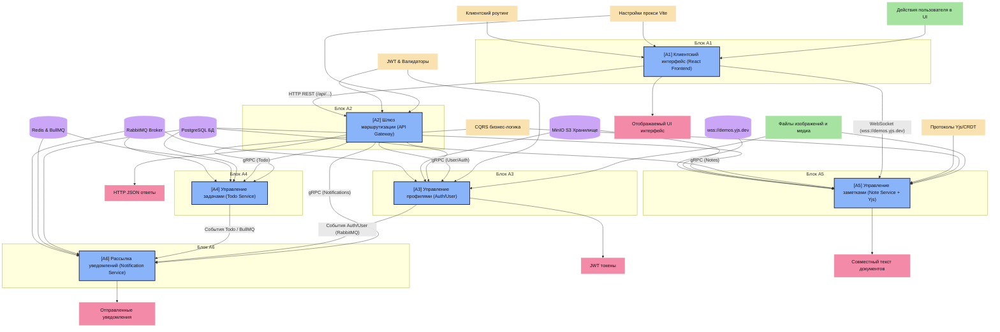

# Функциональная модель IDEF0 для системы Clarte

Данный документ представляет собой функциональное описание архитектуры монорепозитория **Clarte** в соответствии со стандартом **IDEF0** (Integration Definition for Function Modeling).

Модель описывает процессы управления пользователями, авторизацией, задачами (TODO), совместными заметками и уведомлениями, а также интеграционное взаимодействие фронтенда (React) и микросервисов.

---

## 1. Контекстная диаграмма A-0 (Context Diagram)

**Название блока A0**: Управление персональными данными, задачами, заметками и уведомлениями в системе Clarte.  
**Цель моделирования**: Визуализация функциональной структуры системы, потоков данных, механизмов управления и инфраструктурного обеспечения.  
**Точка зрения**: Системный архитектор / Lead-разработчик.

### Описание стрелок диаграммы A-0:
*   **Входы (Inputs - Входные данные с левой стороны)**:
    1.  `Запросы пользователей (HTTP/REST)`: Данные для регистрации/входа, параметры создания задач/заметок, запросы на изменение профиля.
    2.  `Файлы и медиа-контент`: Аватары пользователей, вложения в заметки для загрузки на S3-хранилище.
    3.  `События совместного редактирования`: Текстовый ввод пользователей в реальном времени.
*   **Управление (Controls - Правила и ограничения сверху)**:
    1.  `Конфигурация среды (.env, nx.json, tsconfig.json)`: Параметры портов, адресов, лимитов систем.
    2.  `Политики безопасности и JWT-правила`: Правила авторизации маршрутов, время жизни токенов (AccessToken, RefreshToken).
    3.  `API Контракты и gRPC-схемы (Proto-файлы)`: Строго заданные структуры сообщений для межсервисного обмена.
    4.  `CRDT-протоколы синхронизации Yjs`: Алгоритмы автоматического разрешения конфликтов при совместном редактировании.
*   **Выходы (Outputs - Результаты работы системы с правой стороны)**:
    1.  `HTTP JSON ответы Gateway`: Результаты выполнения запросов, сообщения об ошибках, Swagger-документация.
    2.  `События и отправленные уведомления`: Уведомления, отправленные пользователям через почту/очередь.
    3.  `Состояние хранилищ`: Обновленные записи в БД PostgreSQL, сохраненные файлы в S3 MinIO.
    4.  `Синхронизированный текст заметок`: Обновленный в реальном времени текст у всех подключенных участников.
    5.  `Системные логи и метрики`: Отслеживание работы серверов (NestJS Logger).
*   **Механизмы (Mechanisms - Исполнители снизу)**:
    1.  `Клиентское приложение React + Vite`: Frontend-приложение (порт 4200) на базе компонентов Mantine.
    2.  `NestJS Микросервисы`: Исполняемый код (`api-gateway`, `user-service`, `auth-service`, `note-service`, `todo-service`, `notification-service`).
    3.  `Инфраструктура хранения и очередей (Docker Compose)`: Базы данных PostgreSQL, кэш/планировщик Redis (BullMQ), брокер сообщений RabbitMQ, S3 хранилище MinIO.
    4.  `Облачный провайдер Websocket (Yjs Demos)`: Сервер сигнализации `wss://demos.yjs.dev` для синхронизации Yjs-документов.
    5.  `Nx CLI & pnpm`: Среда сборки, оркестрации монорепозитория и управления зависимостями.

### Mermaid-представление контекстной диаграммы A-0:

```mermaid
graph TD
    %% Стилизация блоков
    classDef default fill:#1e1e2e,stroke:#cdd6f4,stroke-width:1px,color:#cdd6f4;
    classDef activity fill:#89b4fa,stroke:#1e1e2e,stroke-width:2px,color:#11111b;
    classDef input fill:#a6e3a1,stroke:#a6e3a1,stroke-width:1px,color:#11111b;
    classDef control fill:#f9e2af,stroke:#f9e2af,stroke-width:1px,color:#11111b;
    classDef output fill:#f38ba8,stroke:#f38ba8,stroke-width:1px,color:#11111b;
    classDef mechanism fill:#cba6f7,stroke:#cba6f7,stroke-width:1px,color:#11111b;

    subgraph Inputs [Входы - Inputs]
        I1[HTTP/REST запросы пользователей]:::input
        I2[Файлы изображений и медиа]:::input
        I3[Потоки редактирования Yjs]:::input
    end

    subgraph Controls [Управление - Controls]
        C1[Конфигурация сред .env/nx.json]:::control
        C2[Правила безопасности и JWT]:::control
        C3[gRPC Proto контракты]:::control
        C4[CRDT Алгоритмы Yjs/Y-Websocket]:::control
    end

    subgraph Mechanisms [Механизмы - Mechanisms]
        M1[React + Vite Клиент]:::mechanism
        M2[Микросервисы NestJS]:::mechanism
        M3[Docker Compose: Postgres/Redis/RMQ/MinIO]:::mechanism
        M4[WebSocket сервер wss://demos.yjs.dev]:::mechanism
        M5[Среда сборки Nx & pnpm]:::mechanism
    end

    subgraph Process [Функциональный блок]
        A0["[А0] Функционирование системы Clarte"]:::activity
    end

    subgraph Outputs [Выходы - Outputs]
        O1[HTTP JSON ответы клиентам]:::output
        O2[События и уведомления в реальном времени]:::output
        O3[Измененное состояние БД и S3]:::output
        O4[Синхронизированный текст заметок]:::output
        O5[Логи работы и метрики]:::output
    end

    %% Связи
    I1 --> A0
    I2 --> A0
    I3 --> A0
    
    C1 --> A0
    C2 --> A0
    C3 --> A0
    C4 --> A0
    
    M1 --> A0
    M2 --> A0
    M3 --> A0
    M4 --> A0
    M5 --> A0
    
    A0 --> O1
    A0 --> O2
    A0 --> O3
    A0 --> O4
    A0 --> O5
```

---

## 2. Диаграмма декомпозиции A0 (Decomposition Diagram)

Система декомпозируется на **6 основных процессов (функциональных блоков)**:

1.  **А1: Клиентский интерфейс и локальное управление состоянием (React Frontend)**
2.  **А2: Маршрутизация и обработка внешних запросов (API Gateway)**
3.  **А3: Аутентификация и управление профилями (Auth & User Services)**
4.  **А4: Управление задачами и планирование напоминаний (Todo Service)**
5.  **А5: Управление заметками и совместное редактирование (Note Service + Yjs)**
6.  **А6: Обработка очередей и рассылка уведомлений (Notification Service)**

---

### Подробное описание функциональных блоков декомпозиции:

#### Блок А1: Клиентский интерфейс и локальное управление состоянием (React Frontend)
*   **Вход**: Действия пользователя (клики, ввод текста), сохраненные локальные данные в `localStorage`.
*   **Управление**: Маршрутизация страниц (`react-router-dom`: `/`, `/login`, `/register`), правила кеширования (`clarte_tasks_cache`, `clarte_user_profile`, `clarte_notifications_cache`), UI-кит Mantine.
*   **Механизмы**: Приложение React + Vite (порт 4200), хуки `useTasks`, `useNotes`, `useProjects`, `useAuth`.
*   **Выход**: Исходящие HTTP/REST-запросы к API Gateway (`/api/...`), WebSocket-подключения к `wss://demos.yjs.dev` для Yjs, обновленный UI на экране.

#### Блок А2: Маршрутизация и обработка внешних запросов (API Gateway)
*   **Вход**: REST API запросы от React Frontend (`/api/todos`, `/api/notifications`, `/api/users/me` и др.).
*   **Управление**: Схемы валидации запросов (DTO, class-validator), правила проверки JWT в заголовках (`JwtModule`), конфигурация прокси dev-сервера Vite (`vite.config.mts`).
*   **Механизмы**: NestJS API Gateway на порту 5000, gRPC-клиенты связи со внутренними микросервисами.
*   **Выход**: Внутренние gRPC-запросы к сервисам, HTTP JSON-ответы фронтенду.

#### Блок А3: Аутентификация и управление профилями (Auth & User Services)
*   **Вход**: Данные регистрации/входа (gRPC от Gateway), загружаемые аватарки пользователей.
*   **Управление**: Хэширование паролей Argon2, правила генерации JWT ключей, лимиты на медиа-файлы.
*   **Механизмы**: NestJS `auth-service` (порт 5002) и `user-service` (порт 5001), база данных PostgreSQL (порт 6000), S3 MinIO (генерация Presigned URLs для аватаров).
*   **Выход**: Токены аутентификации (Access/Refresh Tokens), данные пользователя, события авторизации в RabbitMQ (`clarte_events_exchange`).

#### Блок А4: Управление задачами и планирование напоминаний (Todo Service)
*   **Вход**: Команды gRPC на CRUD-задачи (создание, изменение, удаление, завершение), события таймера планировщика.
*   **Управление**: CQRS (Command & Query Responsibility Segregation) обработчики (`CreateTodoHandler`, `UpdateTodoHandler`), бизнес-логика напоминаний.
*   **Механизмы**: NestJS `todo-service` (порт 5004), БД PostgreSQL (порт 6002), Redis + BullMQ (очередь таймеров `TODO_BULLMQ_TIMERS`).
*   **Выход**: Созданные/измененные задачи в БД, задачи на напоминание (события-напоминалки в RabbitMQ).

#### Блок А5: Управление заметками и совместное редактирование (Note Service + Yjs)
*   **Вход**: Команды создания заметок, бинарные файлы-вложения заметок, WebSocket-сообщения обновления текста.
*   **Управление**: CQRS-хэндлеры заметок (`CreateNoteHandler`), правила файловой системы S3, протоколы синхронизации Yjs (WebsocketProvider).
*   **Механизмы**: NestJS `note-service` (порт 5003), БД PostgreSQL (порт 6001), S3 MinIO (порт 6003), Websocket-провайдер Yjs (`wss://demos.yjs.dev`), компонент `CollaborativeEditor.tsx`.
*   **Выход**: Структурированные заметки в БД, сохраненные медиафайлы в S3 bucket, синхронный текст документов в режиме реального времени.

#### Блок А6: Обработка очередей и рассылка уведомлений (Notification Service)
*   **Вход**: Системные события из RabbitMQ (обменник `clarte_events_exchange`, очередь `notification_queue`), команды gRPC.
*   **Управление**: Шаблоны писем/уведомлений, правила маршрутизации очереди (Topic Exchange).
*   **Механизмы**: NestJS `notification-service` (порт 5005), RabbitMQ (порт 7001), PostgreSQL (порт 6005).
*   **Выход**: Отправленные уведомления (Email, Push, консольный лог), логи транзакций доставки в БД.

---

### Mermaid-диаграмма декомпозиции A0:

---

## 3. Таблица сопоставления портов и инфраструктуры (IDEF0 Механизмы)

В таблице ниже приведена привязка конкретных портов и контейнеров к механизмам IDEF0:

| Микросервис / Ресурс | Порт | Взаимодействующие блоки IDEF0 | Роль в системе |
| :--- | :--- | :--- | :--- |
| `frontend` / `React` | **4200** | A1 | Клиентское приложение React + Vite |
| `api-gateway` | **5000** | A2 | Входной HTTP-шлюз, Swagger-документация |
| `user-service` | **5001** | A3, A2 | Управление пользователями (gRPC) |
| `auth-service` | **5002** | A3, A2 | Аутентификация, выпуск токенов (gRPC) |
| `note-service` | **5003** | A5, A2 | Сервис заметок (gRPC) |
| `todo-service` | **5004** | A4, A2 | Сервис управления задачами (gRPC) |
| `notification-service` | **5005** | A6, A2 | Сервис уведомлений (gRPC + RMQ) |
| `postgres` (User) | **6000** | A3 | Хранение данных профилей и хэшей паролей |
| `postgres` (Notes) | **6001** | A5 | Хранение текстового содержимого заметок |
| `postgres` (Todo) | **6002** | A4 | Хранение списка дел и напоминаний |
| `postgres` (Notif) | **6005** | A6 | Журналирование отправленных уведомлений |
| `minio-console` | **6004** | A3, A5 | Консоль управления S3-хранилищем |
| `redis` | **7000** | A4, A6 | База для BullMQ (расписание напоминаний о задачах) |
| `rabbitmq` | **7001** | A3, A4, A6 | Брокер сообщений для асинхронного вызова уведомлений |
| `wss://demos.yjs.dev` | **443 (WSS)**| A5 | Внешний WebSocket-сервер синхронизации документов |
